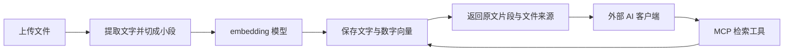

# 联大 · 研发部知识平台

这是一个带中文管理页面的研发部知识平台。按知识库和子文件夹上传资料、连接 embedding 模型，外部 AI 通过获授权的 MCP API Key 检索原文并获得来源。

## 知识库、文件夹和访问授权

内置“技术组FAQ查询”“错题本记录”“AI查询机器人”三个业务库，也可新建其他库。升级前的文件自动进入“默认知识库”，维护人员在网页用“移动”归类；文件 ID、原文件和已有检索向量保留，不需要因为移动目录再次调用 embedding。

每个库可创建多层子文件夹，上传保存到当前目录。目录是数据库维护的逻辑结构，磁盘原文件继续使用随机 ID；不要直接改服务器上传目录。仅允许删除空文件夹，跨知识库移动文件可在“移动资料”中选择目标。

网页“API Key 授权”用于创建多个 MCP 只读凭证：

- 先设置 `RAG_ADMIN_TOKEN`；管理员凭证用于文件维护、模型配置与 Key 管理。
- 每个 Key 选择一个或多个知识库，也可选择“全部知识库（包含未来新建）”。
- 明文 Key 只在创建时显示，数据库仅存摘要。可修改授权范围或撤销，下一次请求生效。
- Key 只能检索、列出、读取和下载获授权的文件，不能上传、删除资料或修改配置。
- 客户端使用 `Authorization: Bearer <API Key>`，MCP 地址仍为 `/mcp/`。
- `search_knowledge`、`list_documents` 可传 `library_id`；不传则查询当前 Key 的全部获授权库。`list_documents` 同时返回这些库的名称与 ID。
- Key 请求得到的源文件下载链接有效 10 分钟，不包含明文 Key。撤销 Key 或移出授权范围会阻止后续下载；过期后重新检索取得新链接。管理员网页下载自动携带页面内的管理员凭证。
- 设置 `RAG_PUBLIC_URL` 为用户能访问的完整服务地址，否则下载链接默认指向本机。

`RAG_MCP_TOKEN` 保留旧客户端兼容，但该环境令牌始终是全库权限。客户端迁移到网页创建的 Key 后，移除旧令牌，避免留下无法按库管理的访问途径。API Key 不是登录账号；第一版同一个 OpenClaw Agent 使用全库 Key，其使用者共享全部资料访问权限。

UI 使用公司原始 Logo、浅蓝白色样式及你指定的 [UI UX Pro Max Skill](https://github.com/nextlevelbuilder/ui-ux-pro-max-skill)。原始 Skill 与许可证保存在 `.skills/ui-ux-pro-max/`；设计查询中未匹配本平台的营销页和深色配色建议未采用。

## 先运行起来

在项目目录打开终端，确认 Docker Desktop 正在运行，然后执行：

```powershell
docker compose up -d --build
```

浏览器打开 **http://127.0.0.1:8010**。本项目选择 8010，是因为开发时本机 8000 已有其他服务占用。Docker 内部仍使用 8000。

初次构建需要联网下载 Python 镜像与依赖。后续启动通常可以复用已有镜像。

按下面顺序操作：

1. 打开“模型配置”，填写接口基础地址、embedding 模型名称和 API Key。
2. 点击“测试连接”。成功后点击“保存配置”；测试连接不会自动保存。
3. 返回“知识库”，拖入文件，等待状态变为“可检索”。
4. 在“检索试验”中输入一个问题，查看是否找到原文片段。
5. 在支持 MCP Streamable HTTP 的 AI 客户端中接入 `http://127.0.0.1:8010/mcp/`。

你也可以先上传文件：没有配置模型时，文件状态为“待索引”。配置完成后点击“重建索引”。

模型接口需要接受 `POST <基础地址>/embeddings`，请求中的 `input` 是文字数组，返回 `data` 数组，其中每项包含 `index` 和 `embedding`。模型名称必须是服务商实际支持的向量模型。项目没有附带 API Key，也不会下载或运行本地模型。

**Docker 内的 localhost 指容器自己。** 如果模型接口运行在你的电脑上，基础地址可填写 `http://host.docker.internal:接口端口/v1`；同时确认该接口允许 Docker 网络访问。

## 用小白能理解的方式解释



- **RAG**：回答之前先从你的资料里找依据。本项目负责其中的资料管理和检索，最后的回答由接入 MCP 的 AI 生成。
- **embedding**：把一段文字转成数字向量，用来比较文字的相似程度。向量相似并不保证片段能够回答问题。
- **MCP**：AI 调用工具的协议。在这里，AI 可以查知识库、列文件和读原文。
- **Docker**：把程序和运行环境装在一个容器中。你不必手动安装全部 Python 依赖。
- **Git commit**：开发阶段的本地保存点，可以查看每次改了什么，也能回到之前的版本。

文件片段会发送到你配置的模型接口。向量与提取文字保存在本地 SQLite 数据库中。

## MVP 已有功能

| 功能 | 行为 |
| --- | --- |
| 文件上传 | TXT、Markdown、可提取文字的 PDF、Word (DOCX)、Excel (XLSX)、PPT (PPTX) 和 CSV，单文件上限 50 MiB |
| 文件管理 | 查看处理状态、分页预览原文、重新索引、启用、禁用、删除 |
| 模型配置 | 网页修改地址、模型名称、密钥；测试连接；保留或清除密钥 |
| 模型切换 | 接口或模型名称变化时旧索引失效，重建后再参与检索 |
| 检索试验 | 返回排序后的原文片段、文件名称、片段编号和余弦相似度 |
| MCP | `search_knowledge`、`list_documents`、`get_document` |
| 暂停业务 | 停止上传、检索和索引重建，保留管理界面用于恢复 |
| 访问保护 | 可配置独立管理员令牌和 MCP 令牌；限制 Host；拒绝跨站写操作 |
| 部署 | 单进程 Docker、非 root 运行、健康检查、命名卷持久化 |

“暂停业务”会等待正在处理的任务完成。文件禁用后不参与检索，MCP 也不能读取该文件。删除会移除源文件、提取文字和向量。

## MCP 接入

服务地址：

```text
http://127.0.0.1:8010/mcp/
```

在客户端选择 **Streamable HTTP**。不同客户端的配置格式不同；本项目没有假设所有客户端都使用同一种 JSON 配置。

| 工具 | 参数 | 返回 |
| --- | --- | --- |
| `search_knowledge` | `query`、`top_k`（1–20，默认 5） | 相关片段、文件来源、相似度 |
| `list_documents` | 无 | 启用文件及索引状态 |
| `get_document` | `document_id`、`offset`（默认 0） | 原文、文字总量、下一页偏移量 |

`get_document` 返回 `next_offset` 时，可以用它继续读取。文件内容是引用资料，不应当作为新的系统指令。建议在客户端提示 AI：“先检索知识库，依据原文回答并标注文件名；资料不足时明确说明。”

如果 AI 客户端运行在另一台机器或云端，它不能直接访问你的 `127.0.0.1`。需要使用可达的服务器地址并配置访问保护。

本机验证工具发现和文件列表：

```powershell
python scripts/check_mcp.py
```

配置模型、上传文件后，可以验证检索：

```powershell
python scripts/check_mcp.py --query "你的具体问题"
```

该脚本默认直连服务，不继承系统代理。它需要安装项目 Python 依赖。MCP 使用的是[官方 Python SDK 1.13.1](https://github.com/modelcontextprotocol/python-sdk/tree/v1.13.1)；原版界面使用的 Anthropic frontend-design Skill 保留在 `.skills/frontend-design/` 供追溯。

## 启动、停止和日志

所有命令在项目目录执行：

```powershell
# 启动，代码有改动时重新构建
docker compose up -d --build

# 查看运行状态，正常应显示 healthy
docker compose ps

# 查看最近 100 行日志
docker compose logs --tail 100 rag

# 完全停止服务器进程，保留数据
docker compose stop

# 恢复
docker compose start

# 重建容器，仍保留持久卷中的资料
docker compose up -d --force-recreate
```

**不要执行 `docker compose down -v` 来日常停止服务。** `-v` 会删除命名卷，也会删除文件、数据库和加密密钥。

## 端口与访问令牌

默认仅发布到本机，并且不设置访问令牌，适合个人试用。

需要修改端口或内网部署时，先复制配置文件：

```powershell
Copy-Item .env.example .env
```

在 `.env` 中编辑参数：

| 参数 | 作用 |
| --- | --- |
| `RAG_BIND_ADDRESS` | 默认 `127.0.0.1`；需要内网访问时改为对应网卡地址，或 `0.0.0.0` |
| `RAG_PORT` | 浏览器使用的端口，默认 `8010` |
| `RAG_ALLOWED_HOSTS` | 逗号分隔的主机名/IP，不包含协议与端口；添加访问地址时保留 `localhost,127.0.0.1,::1` |
| `RAG_ADMIN_TOKEN` | 保护管理 API，网页会提示输入管理员令牌 |
| `RAG_MCP_TOKEN` | 独立保护 MCP，外部客户端需要携带 Bearer 令牌 |
| `RAG_PUBLIC_URL` | 用户可达的服务完整地址，用于引用源文件下载链接 |

两个令牌应使用不同的随机值。可在本机终端生成两次，并各自填写到 `.env`：

```powershell
python -c "import secrets; print(secrets.token_urlsafe(32))"
```

改好后运行 `docker compose up -d` 使环境变量生效。网页管理员令牌只保存在当前页面内存，刷新页面后需要重新输入。配置 MCP 令牌后，客户端请求头应为：

```text
Authorization: Bearer <你设置的 RAG_MCP_TOKEN>
```

公网部署还需要域名、HTTPS 反向代理和适当的网络访问控制。MVP 只提供令牌保护，没有账号注册、多人权限体系或 OAuth 登录。

## 数据与备份

Docker 数据保存在项目命名卷 `zhiku-rag_rag-data` 中，容器内目录为 `/data`：

```text
/data/
  knowledge.sqlite    配置、文件文字与向量
  secret.key          API Key 加密密钥
  uploads/            使用随机名称保存的原文件
```

上传文件、`.env`、数据库、密钥、备份和日志都被 Git 忽略。加密密钥与数据库同目录；能够读取整个数据目录的人仍能解密 API Key，因此应限制服务器与备份目录的访问。

备份前暂停整个容器，避免复制正在变化的 SQLite 数据库。下面示例把整个数据目录复制到项目内被 Git 忽略的备份目录：

```powershell
New-Item -ItemType Directory -Force backups
docker compose stop
docker compose cp rag:/data ./backups/data
docker compose start
```

应一起保留原文件、数据库和 `secret.key`。恢复时需停止服务，将完整备份恢复到 `/data`，并确保用户 ID `10001` 能读写；不要只替换其中一个文件。

## 不使用 Docker 时

推荐 Python 3.12，与容器环境一致。代码也已在现有 Python 3.10 环境验证。使用项目独立环境，不要改动你已有项目的全局依赖：

```powershell
python -m venv .venv
.\.venv\Scripts\python -m pip install -r requirements.txt -c requirements.lock
.\.venv\Scripts\python -m uvicorn app.main:app --host 127.0.0.1 --port 8010 --ws none
```

本地模式默认保存到项目的 `data/`。如果 Docker 已占用 8010，请先停止容器或选择另一个端口。需要加载 `.env` 时，可以在 uvicorn 命令中添加 `--env-file .env`；本地监听地址和端口仍由 uvicorn 的 `--host`、`--port` 指定。

## 开发与验证

```powershell
# 行为测试，不需要真实模型密钥
python -m unittest discover -s tests -v

# 浏览器验收（安装可选开发依赖和 Chromium）
python -m pip install -r requirements-dev.txt -c requirements.lock
python -m playwright install chromium
python -m tests.browser_smoke
python -m tests.browser_catalog

# 实际 Docker 新部署验收：仅适用于尚未配置模型的服务
# 会创建自己的临时文件、重建本项目容器，然后清理临时文件
python -m tests.docker_smoke
```

`requirements.lock` 记录实际 Docker 构建中的依赖版本；基础镜像也固定了摘要。行为测试与浏览器验收中的 embedding 使用测试替身，仅证明文件处理、协议与业务流程，不证明真实模型的语义检索质量。

阶段提交和改动可以这样查看：

```powershell
git log --oneline --decorate
git status
```

## 当前限制

- 单个文件最多 50 MiB；提取文字最多约 680 万字符 / 10000 段；PDF 最多 1000 页，DOCX/XLSX/PPTX 解压后最多 200 MiB。
- 支持 TXT、Markdown、PDF、Word (DOCX)、Excel (XLSX)、PPT (PPTX) 和 CSV 文件。旧版二进制 .doc/.xls/.ppt 请另存为新版格式上传。
- 单个生效模型配置，不提供多模型切换库或内置聊天页面；本地 OCR 支持中英文印刷文字，识别结果保留来源标记。
- 扫描 PDF 和 Office 图片可进行本地 OCR；复杂版式的阅读顺序和识别准确性需要人工检查。
- 上传与重建在当前请求内执行。模型调用按每批 32 段处理，每批超时 45 秒；大文件会花较长时间，建议先从小文件试用。
- 向量存入 SQLite，检索逐段计算余弦相似度；没有大规模数据或多人并发性能验收。服务必须使用一个 worker。
- 地址和模型名称相同，但服务商在背后替换了模型时，系统无法自动识别；发现维度变化会提示重建，其他变化需要你手动重建。
- 暂未配置真实 embedding 服务，因此真实模型连接、额度与检索效果需用你自己的接口验证。

详细验证证据见 [验收记录](docs/验收记录.md)。
